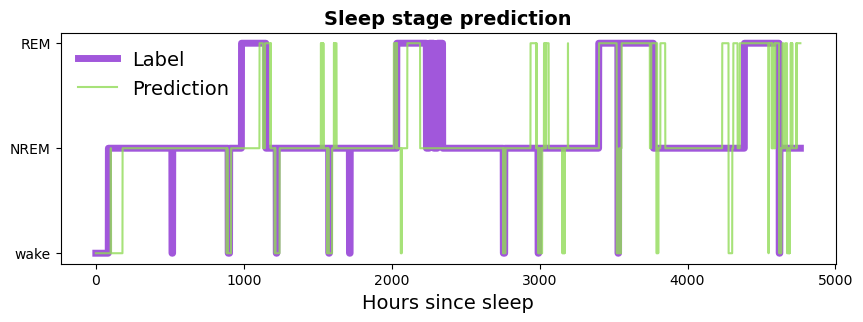

# Sleep stage classification using Apple Watch data

## Description

This project aims to study the use of data gathered from a consumer wearable device (Apple Watch), to predict the sleep stages of individuals. 

The raw sensor data are transformed into features and fed into a CatBoost gradient boosted classifier to predict the sleep stages.



The dataset is collected at the University of Michigan from June 2017 to March 2019 (Walch 2019), contains motion ($g$ forces in $x$, $y$, and $z$), heart rate (bpm), steps (count), and labeled sleep data (wake = 0, N1 = 1, N2 = 2, N3 = 3, REM = 5) across 31 subjects. The data was collected using Apple Watches during the period of the study.

The data is preprocessed using the python script supplied in the foundational work conducted by Walch (2019).

## Usage

Clone the repo

```sh
git clone https://github.com/jiemingyou/sleep-stage-prediction-bst.git
cd sleep-stage-prediction-bst
```

Run the main script to process the data and train the model

```sh
python main.py
```

## References
Walch, O. (2019). Motion and heart rate from a wrist-worn wearable and labeled sleep from polysomnography (version 1.0.0). PhysioNet. https://doi.org/10.13026/hmhs-py35.